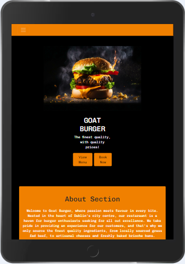
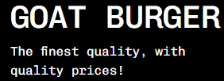
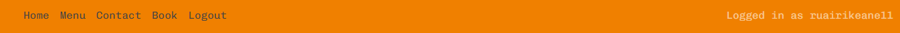
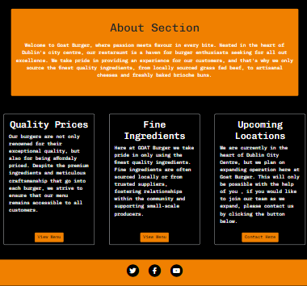
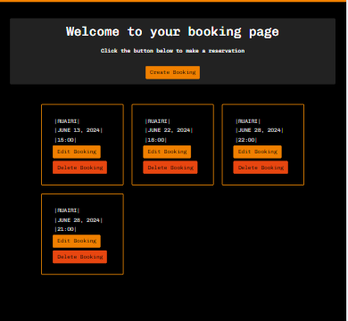
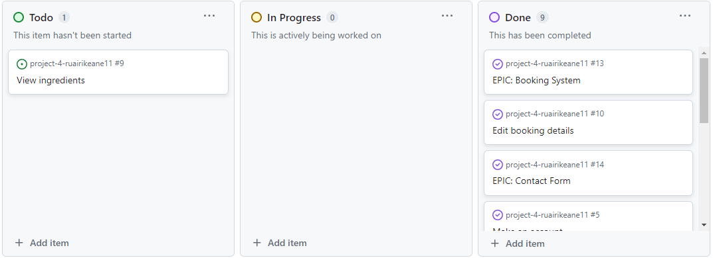

# Goat Burger Website

Goat Burger is a website designed for a gourmet burger restaraunt in the heart of Dublin's city centre. It's simple design makes the website very easy for the user navigate through. Any user of the website is able to view the menu page. A user is able to interact with all of the other features the site has to offer once they have signed up and made an account. Users can create, edit and delete all existing bookings made with their logged in account. The logged in user can also fill out a form to get in touch regarding any other general queries.

  

## Table Of Contents 
1. User Experience
2. Features
3. Technologies Used
4. Testing
5. Deployment 
6. Credits

# 1. User Experience
## User goals are:
 - View restaraunt menu.
 - Create, edit and delete bookings.
 - Get in touch regarding any other general queries.
 - Make an account using an email and password.

## This reaches the user goals by:
 - Providing a menu page, regardless of wether the user is logged in.
 - Providing a booking form on the booking page.
 - Providing a contact form on the contact page.

## User stories:
 - As a site user I can register an account so that I can make a booking or use the contact section.
 - As a site user I can view the menu so that I know what the restaraunt offers.
 - As a site user I can make a booking so that I can eat at the restaraunt at my desired time.
 - As a site user I can cancel my booking so that it is deleted from database.
 - As a site user I can edit my booking so that I can change the date/time.
 

### Colors 
- The website uses 3 main colours. The navbar and footer are both styled in orange to contrast with darkness of the body content of each page. The buttons to either create or edit are typically the same colour as the nav and footer, while the buttons to delete a booking/inquiery are red. The booking form and the conatct form also contain a background colour of #222222, this is a dark grey and therefore sticks to the design principle of having a small colour pallete of black/grey, tangerine and red.

### Font 
- I decided to use the 'Chivo Mono' font from [GoogleFonts](https://fonts.google.com/) throughout all pages of the website, because it is plain while also being captivating for the viewer. I think this font is especially suiting for a simply designed website, with a dark coloured body. It is also sans-serif, which makes the font easy to follow for all viewers.

### Icons 
- The icons are found in the footer, located at the bottom of every page. They are taken from [Fontawesome](https://fontawesome.com/), and are all utilised as classes in the i tag, therefore easily targeted and customised. Once an icon clicked, the link will bring you to the desired website.

### Images 
- The website includes one hero image to captivate the viewers attention. It is found on the landing page and there are links to view the menu and make a booking are directly beside the image. This is done on purpose to encourage the user to make use of the buttons on the homepage. 

# 2. Features

### Navbar
- The website incorpates a responsive navbar depending on the screen size in use. If not logged in, the navbar, will display a 'Register' and 'Login' page. 

- Once logged in, the 'Register' and 'Login' page will both dissapear and be replaced with a 'Sign Out' page, which gives the option to log out of their user account. Text will be displayed on the right hand side of the navbar, displaying 'Logged in as' with the username after. In the production, I created a user with the username of 'ruairikeane11', there 'Logged in as ruairikeane11' will appear in a muted text in the right hand side.

- When being viewed on a smaller screen, a toggler icon will appear on the left hand side, once clicked, the links to all of the other pages will appear vertically stacked.

### Footer 
- At the bottom of each page there is a footer. It is styled in the same color as the navbar the keep consistency within the site(#fc9003). Here, you can find links the social media sites like Youtube, Facebook and Twitter. 

### About Section
- On the homepage, beneath the hero image, there lies an 'About' section. This welcomes the viewer to the website and gives a little bit of information about the location of the resteraunt and what the business truely values, which is taking pride in its products and service. Beneath, there lies 3 bootstrap styled cards alligned horizontally. These 3 cards also give the viewer more specific information about the prices, ingredients and the upcoming location. Each card has a button which will either redirect you to the menu page, or to the contact page, where a logged in user can fill out a form to make a request to the business.

### Booking Page
- The booking page is simply designed. It has text at the top of the page welcoming the user to the page and beneath there is a button that brings you to fill out the booking form once clicked. At the bottom, above the footer, lies a record of all bookings made by the logged in user.

- Once the button is clicked, the user can then fill out a form with several fields to confirm the time, date and number of people who will make use of the booking at the restaraunt. 

- You can see here that once the form is filled out the user is redirected to the booking page with the recorded booking at the bottom. The user is also notified once their booking is created. The alert lies just beneath the navbar.

### Contact Page

- If a user is logged in, they have access to use the contact page. On this page the user can fill out a form with four fields. Title, name, email and lastly, the content. A user can fill the content field with any geneal queries or request they have. Once the form is submitted, an alert will appear just beneath the navbar to notify the user that their request has been submitted.

# 3. Technologies Used 
### HTML 
- HTML was used to write all of the content on each page.

### CSS 
- I used a CSS to style each page. You can all of the styling in the style.css file.

### Python 
- I used Python classes for my 2 models. Similarly, all of the views, forms, and url files are all written in Python code.

### Bootstrap
- I used Bootstrap styling to simply design some elements, for example, the layout of the home page. Any further, more specific styling was written in the style.css file.

### Django 
- I used Django, a python based framework to complete this project. Django provides a structure that makes the development process simple and clean.

## Librares 

### Google Fonts
- I used [GoogleFonts](https://fonts.google.com/) to import the 'Chivo Monu' font. 
### Fontawesome
- I used [Fontawesome](https://fontawesome.com/) for the font styling throughout.

## Platforms

### Github
- I used Github to store my code locally

#### User Stories
- I used User Stories throughout the development process. I mistakenly linked them to the wrong repository and had to go back and recreate them with the correct repository. I had several user stories while producing this site. Once a user story was in production, I moved it from the 'To do' section to the 'In progress' section. Once completed, I moved it to the 'Done' section. Each user story was labelled with 'Must have', 'Should Have', 'Could Have', or 'Wont Have'.

- You can see here that there was one user story that I did not complete. This was for the ingredients to be visible to the user, which I did not get to complete as it was labelled with 'Could Have' and I prioritied making notifications to the user whenever data is recorded, updated or deleted.

### Gitpod
- Gitpod was used as my IDE for the project development.

# 4. Testing 

### Validation 

- HTML has been validated with [W3C HTML5 Validator](https://validator.w3.org/).
- CSS has been validated with [W3C CSS Validator](https://jigsaw.w3.org/css-validator/).
- Python has been validated with [CI PYTHON LINTER](https://pep8ci.herokuapp.com/).

### Manual Testing 
- I used Devtools for the development of this website. I often would test different styles in the devtools environment, before writing them in my style.css file. 
- I used the 'Lighthouse' feature to ensure my project scored high in performance and accessibilty on each page.

#### Desktop Testing
- The site was developed on a laptop and the majority of the testing was done on Google Chrome.
- The site was tested on other browsers.
- The site was sent to friends and family with different laptop sizes to get different looks.

### Mobile Testing
- I sent the site to myself and viewed it on a Iphone XR.
- I used Devtools to view the site on many different mobile screen sizes
- The site was also sent to numerous different mobile users to get feedback about its responsiveness.

### Automated Testing
- I decided to not use automatic testing in the production of this project. As you can see, there is nothing in the test.py files. This is because I did not feel it was needed and I was able to test all of the functionality without having to use automated tests.

# 5. Deployment 
## Local 
- This project was deployed locally, pushing all changes to Github.
- A'.gitignore' file was created to exclude all files and directories that should not be tracked.
- All changes to the enviroment were documented using 'git add .', 'git commit -m "Commit"'.
- These steps made the production simple and easy to track.

## Heroku 
- This project was deployed early on in the development stage with Heroku.
- For deployment, 'DEBUG' was set to 'False'.
- 'ALLOWED_HOSTS' was updated.
- A 'Procfile' was created for Heroku deploy.
- A 'requirements.txt' was added with all of the dependecies listed.
- Two config vars were added. The 'DATABASE_URL' and a 'SECRET_KEY'.
- A python buildpack was also added in the settings tab.

# 6. Credits

## I Think Therefore I Blog (Walkthrough Project)
- I found the 'I Think Therefore I Blog' walkthrough project very helpful. This walkthrough project allowed me get familiar with the django framework before starting my own website. I took a lot of inspiration from the file structure and even the commands in order to create apps and projects.

## Contact 
- Contact @ruairi.rk@icloud.com

