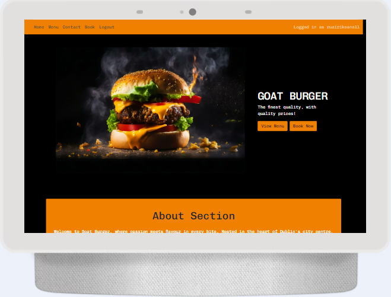
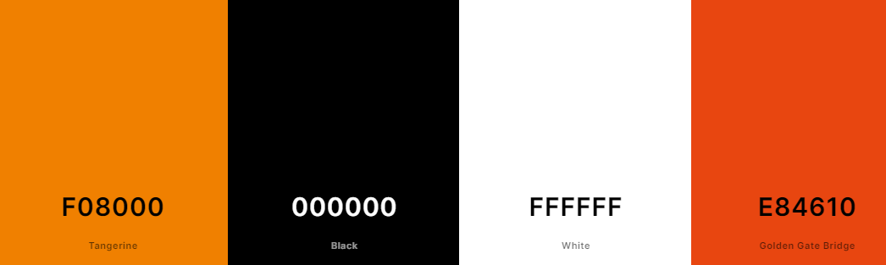
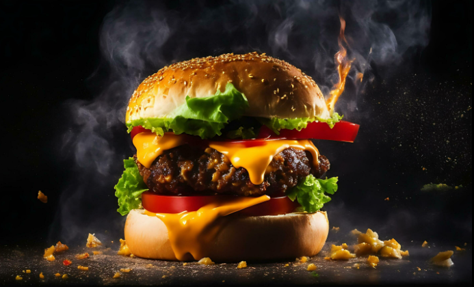
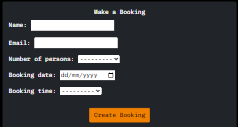
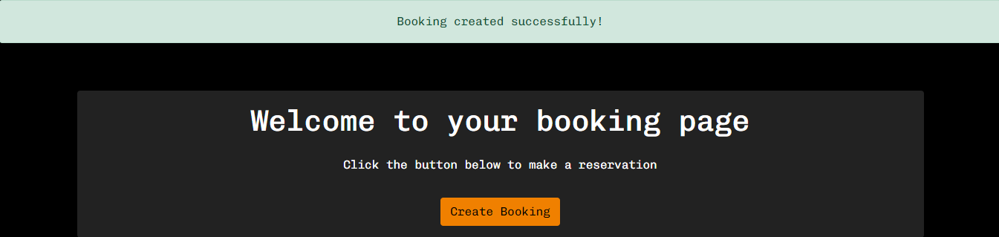
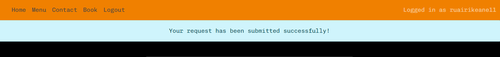

# Goat Burger Website

Goat Burger is a website designed for a gourmet burger restaraunt in the heart of Dublin's city centre. It's simple design makes the website very easy for the user navigate through. Any user of the website is able to view the menu page. A user is able to interact with all of the other features the site has to offer once they have signed up and made an account. Users can create, edit and delete all existing bookings made with their logged in account. The logged in user can also fill out a form to get in touch regarding any other general queries.

## Table Of Contents 
1. User Experience
2. Features
3. Technologies Used
4. Testing
5. Deployment 
6. Credits

# User Experience

## User goals are:
 - View restaraunt menu
 - Create, edit and delete bookings
 - Get in touch regarding any other general queries
 - Make an account using an email and password

## This reaches the user goals by:
 - Providing a menu page, regardless of wether the user is logged in
 - Providing a booking form on the booking page
 - Providing a contact form on the contact page
 

### Colors 
- The website uses 3 main colours. The navbar and footer are both styled in orange to contrast with darkness of the body content of each page. The buttons to either create or edit are typically the same colour as the nav and footer, while the buttons to delete a booking/inquiery are red. The booking form and the conatct form also contain a background colour of #222222, this is a dark grey and therefore sticks to the design principle of having a small colour pallete of black/grey, orange and red.

### Font 
- I decided to use the 'Chivo Monu' font throughout all pages of the website, because it is plain while also being captivating for the viewer. I think this font is especially suiting for a simply designed website, with a dark coloured body. It is also sans-serif, which makes the font easy to follow for all viewers.

### Icons 
- The icons are found in the footer, located at the bottom of every page. They are taken from Fontawesome.com, and are all utilised as classes in the i tag, therefore easily targeted and customised.

### Images 
- The website includes one hero image to captivate the viewers attention. It is found on the landing page and there are links to view the menu and make a booking are directly beside the image. This is done on purpose to encourage the user to make use of the buttons on the homepage. 

# Features

### Navbar
- The website incorpates a responsive navbar depending on the screen size in use. If not logged in, the navbar, will display a 'Register' and 'Login' page. 

- Once logged in, the 'Register' and 'Login' page will both dissapear and be replaced with a 'Sign Out' page, which gives the option to log out of their user account. Text will be displayed on the right hand side of the navbar, displaying 'Logged in as' with the username after. In the production, I created a user with the username of 'ruairikeane11', there 'Logged in as ruairikeane11' will appear in a muted text in the right hand side.

- When being viewed on a smaller screen, a toggler icon will appear on the left hand side, once clicked, the links to all of the other pages will appear vertically stacked.

### About Section

- On the homepage, beneath the hero image, there lies an 'About' section. This welcomes the viewer to the website and gives a little bit of information about the location of the resteraunt and what the business truely values, which is taking pride in its products and service.

- Beneath, there lies 3 bootstrap styled cards alligned horizontally. These 3 cards also give the viewer more specific information about the prices, ingredients and the upcoming location. Each card has a button which will either redirect you to the menu page, or to the contact page, where a logged in user can fill out a form to make a request to the business.

### Booking Page

- The booking page is simply designed. It has text at the top of the page welcoming the user to the page and beneath there is a button that brings you to fill out the booking form once clicked. At the bottom, above the footer, lies a record of all bookings made by the logged in user.

- Once the button is clicked, the user can then fill out a form with several fields to confirm the time, date and number of people who will make use of the booking at the restaraunt. 

- You can see here that once the form is filled out the user is redirected to the booking page with the recorded booking at the bottom.

